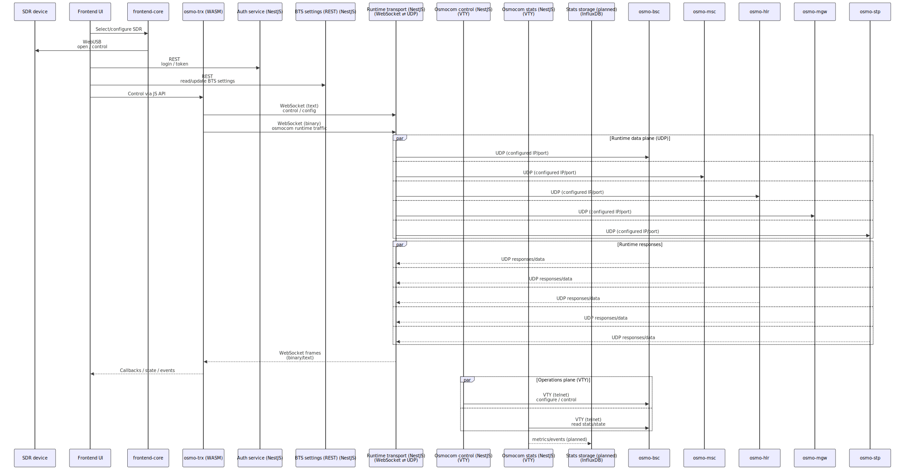

# Platform Architecture Overview

This document describes the high-level production architecture of the platform, its core components, communication model, and design decisions.

The system is built around the idea of running GSM BTS/TRX components directly in the browser using WebAssembly, while preserving full compatibility with existing native Osmocom backend infrastructure.

---

## 1. High-Level Concept

The platform is composed of two cooperating open-source projects:

- **websdr** — a generic web platform providing WebUSB access, user management, authentication, shared utilities, and reusable UI components not specific to Osmocom.
  https://github.com/wavelet-lab/websdr
- **osmoweb** — an Osmocom-specific platform implementing browser-based BTS/TRX execution, runtime transport (WebSocket ⇄ UDP), and operational control/statistics for native Osmocom services.
  https://github.com/wavelet-lab/osmoweb

This separation allows Osmocom-specific logic to remain focused, while generic web and SDR functionality is reusable across projects.

The platform consists of two major parts:

* **Client-side frontend** (Browser)
* **Server-side backend** (Linux)

The browser-based runtime consists of `osmo-bts` compiled to WebAssembly, which communicates with the backend via **WebSocket**.
`osmo-trx` is also compiled to WebAssembly and runs locally in the browser, interfacing directly with the SDR device via **WebUSB** and exposing a local API to `osmo-bts`.

Because browsers cannot use raw UDP sockets, the backend provides a **WebSocket ⇄ UDP bridge** so that browser-based components can communicate with unmodified native Osmocom services.

---

## 2. Server-Side Architecture (Linux)

The server side combines **native Osmocom network elements** with a **NestJS-based web backend** composed of multiple microservices.

### 2.1 Native Osmocom Components

The following Osmocom services run natively on Linux and remain unmodified:

* **osmo-stp** — Signaling Transfer Point
* **osmo-hlr** — Home Location Register
* **osmo-mgw** — Media Gateway
* **osmo-msc** — Mobile Switching Center
* **osmo-bsc** — Base Station Controller

These components communicate using their standard UDP- and SIGTRAN-based interfaces and expose VTY (telnet) control ports.

### 2.2 Backend Implementation Model: `backend-core` + NestJS Microservices

All backend logic is implemented in **`backend-core`** (shared backend module). NestJS is used to expose this functionality as a set of deployable **microservices** (REST APIs / WebSocket gateways) that depend on `backend-core`.

In other words:

* **`backend-core`** provides the Osmocom integration layer:

  * WebSocket ⇄ UDP bridging (runtime transport)
  * Osmocom control via VTY
  * Osmocom statistics collection via VTY
  * BTS configuration logic and Osmocom service management

* **NestJS microservices** provide the higher-level application layers:

  * transport layer (REST / WebSocket)
  * wiring and composition of backend services
  * deployment and scaling boundaries
  * user management
  * authentication
  * statistics persistence

### 2.3 NestJS Web Backend (Microservices)

The web backend is deployed as a set of **NestJS microservices** that call into `backend-core`, including:

1. **User database service** — user storage and management
2. **Authentication service** — login/session/token handling
3. **BTS settings service (REST API)** — manage base-station configuration via REST
4. **Runtime transport service (WebSocket)** — terminates WebSocket connections from browsers and uses `backend-core` to perform WebSocket ⇄ UDP bridging
5. **Osmocom service control service (VTY)** — operational control of `osmo-*` services via VTY (telnet)
6. **Osmocom statistics service (VTY)** — collect runtime status/metrics via VTY (telnet)

Planned (not implemented yet, but part of the target architecture):

* **Statistics storage service** — persist Osmocom statistics into a time-series database (e.g., InfluxDB)

### 2.4 Runtime Transport Bridge (WebSocket ⇄ UDP)

Browser-based BTS/TRX components cannot use UDP directly, so the backend provides a production **WebSocket ⇄ UDP bridge** implemented in `backend-core` and used by the runtime transport microservice.

* Accepts WebSocket connections from browser-based `osmo-trx`
* Supports **binary WebSocket frames** for Osmocom data traffic
* Supports **text WebSocket frames** for control/configuration parameters
* Translates traffic to/from UDP sockets expected by native Osmocom services

Targets are fully configurable:

* Default: `localhost` with standard Osmocom ports
* Custom IP addresses and ports supported
* Enables integration with non-standard or distributed deployments

---

## 3. Client-Side Architecture (Browser)

### 3.1 SDR Integration (WebUSB)

* The SDR device is connected locally to the user’s machine.
* The frontend selects and controls the SDR via **WebUSB**.

### 3.2 osmo-bts (WebAssembly)

* Compiled to WebAssembly
* Runs inside the browser runtime
* Works together with `osmo-trx` as in a classical BTS/TRX architecture

### 3.3 osmo-trx (WebAssembly, Modified)

`osmo-trx` is adapted for browser execution.

#### Transport Layer Changes

* Original **UDP transport replaced by WebSocket**

#### WebSocket Channels

Two logical channels are used:

* **Binary WebSocket channel**

  * Carries Osmocom data traffic
* **Text WebSocket channel**

  * Used for control and configuration parameters
  * Semantics to be documented separately

#### JavaScript Integration Layer

* Custom **JavaScript API** for `osmo-trx`
* Enables control from frontend code and integration with UI logic

---

## 4. Communication Model

### 4.1 Logical Data Path (Runtime Traffic)

### 4.2 Control & Statistics Path (Operations Plane)

Operational control and statistics collection are performed via **VTY (telnet)** from dedicated backend microservices that use `backend-core`:

* VTY control microservice → `osmo-*` VTY ports
* VTY statistics microservice → `osmo-*` VTY ports

Planned:

* Statistics storage microservice → time-series DB (e.g., InfluxDB)

### 4.3 Protocol Mapping

| Segment                         | Transport                | Purpose                              |
| ------------------------------- | ------------------------ | ------------------------------------ |
| Frontend ↔ SDR                  | WebUSB                   | SDR access, device selection/control |
| Browser → Backend               | WebSocket (binary)       | Osmocom runtime data traffic         |
| Browser → Backend               | WebSocket (text)         | Control / parameters                 |
| Bridge → Osmocom                | UDP                      | Native Osmocom runtime communication |
| Backend control/stats → Osmocom | VTY (telnet)             | Operations: control & statistics     |
| Stats storage (planned)         | Ingestion protocol (TBD) | Persist metrics/events to TSDB       |

### 4.4 Gateway transport mapping

The browser-facing gateway uses a single WebSocket connection with **binary** and **text** frames.  
At the backend, the gateway translates these logical channels into native transports towards Osmocom services:

| Logical interface | What is carried | Backend-side transport | Browser ↔ gateway framing |
|---|---|---|---|
| **HLR** | Subscriber data access, authentication requests, subscriber state queries | TCP | WebSocket **text** |
| **BSC (control/status)** | Network control, state queries, configuration and operational commands | TCP | WebSocket **text** |
| **RSL** | Radio Signalling Link: channel activation, paging, measurement reports, radio resource control | TCP | WebSocket **binary** |
| **OML** | Operation & Maintenance: BTS configuration, supervision, alarms, lifecycle control | TCP | WebSocket **binary** |
| **Media (Osmux)** | Voice user-plane traffic (multiplexed voice frames) | UDP | WebSocket **binary** (and text where applicable) |

Notes:
- Each GSM interface is mapped to a dedicated WebSocket endpoint between the browser-based BTS and the backend gateway.
- “WebSocket text/binary” refers to the WebSocket frame type used by the gateway, not to GSM protocol semantics.
- The gateway translates WebSocket-framed traffic into native TCP or UDP connections expected by Osmocom services.

---

## 5 Voice / Audio Transport (Engineering Rationale)

Osmocom supports two user-plane transport mechanisms for voice traffic:

- **RTP (Real-time Transport Protocol)** — a classical VoIP user-plane where each call leg is transported as a separate RTP flow over UDP.
- **Osmux (Osmocom Multiplexing Protocol)** — a purpose-built Osmocom protocol that multiplexes multiple voice channels into a single UDP flow to reduce overhead and simplify transport.

### 5.1 RTP vs Osmux — Comparison

| Aspect | RTP (classic) | Osmux (chosen) |
|------|---------------|----------------|
| Transport model | One RTP flow per call leg | Single multiplexed stream |
| Number of UDP flows | Grows with number of calls | Constant (one stream) |
| WebSocket tunneling | Complex (many parallel flows) | Simple (single stream) |
| Per-packet overhead | High (IP + UDP + RTP headers) | Lower (multiplexed payloads) |
| Browser friendliness | Poor | Good |
| Alignment with Osmocom | Indirect (VoIP-centric) | Native Osmocom protocol |
| Suitability for OsmoWeb | ❌ Not ideal | ✅ Best fit |

### 5.2 Engineering considerations in a browser-based deployment

In OsmoWeb, the BTS/TRX runtime executes inside a web browser and communicates with the backend exclusively via **WebSocket**. This imposes several practical constraints that strongly influence the choice of voice transport:

1. **Number of transport flows**

   - RTP requires **one UDP flow per call leg** (and often per direction), which translates into multiple independent RTP streams.
   - In a browser environment, tunneling multiple RTP streams would require:
     - multiple logical channels,
     - additional demultiplexing logic,
     - more complex state management on the WebSocket bridge.

   Osmux, by contrast, aggregates all active voice channels into **a single multiplexed stream**, which maps naturally onto a single WebSocket connection.

2. **WebSocket tunneling complexity**

   - WebSocket is a message-oriented, connection-oriented transport.
   - Mapping many short-lived or parallel RTP flows onto WebSocket increases:
     - protocol complexity,
     - buffering requirements,
     - error-handling surface.

   Osmux was explicitly designed to carry multiple voice streams within one transport flow, making it **significantly easier to encapsulate over WebSocket** without introducing additional framing layers.

3. **Overhead and efficiency**

   - RTP adds per-packet overhead (IP/UDP/RTP headers) for every voice frame.
   - Osmux reduces this overhead by multiplexing multiple channels and batching payloads, which is especially relevant when voice traffic is forwarded through an additional tunneling layer (WebSocket).

4. **Alignment with Osmocom architecture**

   - Osmux is a native Osmocom user-plane protocol and is directly supported by Osmocom components such as BSC and MGW.
   - Using Osmux avoids introducing a parallel VoIP-centric architecture (SIP/RTP) into a system that is otherwise fully Osmocom-native.

### 5.3 Chosen approach

For these reasons, **OsmoWeb uses Osmux as the voice user-plane protocol**, transported as part of the binary WebSocket stream between the browser-based BTS/TRX and the backend runtime transport service.

This choice minimizes transport complexity, reduces the number of concurrent flows, and aligns naturally with both the browser execution environment and the existing Osmocom architecture.

See diagrams:
- 
- 

---

## 6. Design Principles

* **Browser compatibility**: WebSocket is used instead of UDP; SDR access is via WebUSB
* **Backend compatibility**: native Osmocom services remain unmodified
* **Clean layering**: `backend-core` contains all logic; NestJS microservices expose it via REST/WS
* **Separation of planes**:

  * Runtime data plane: WebSocket ⇄ UDP bridge
  * Operations plane: VTY control/statistics
* **Extensible backend**: statistics persistence (InfluxDB) is a natural additional microservice

---

## 7. Diagrams

### Legend / Notation

### Deployment / Component View

### Runtime Data Flow

### Interfaces & Protocols

---

## 8. Summary

This architecture enables a browser-native GSM BTS/TRX runtime using WebAssembly with SDR access via WebUSB, while preserving compatibility with native Osmocom services.

All backend logic is implemented in `backend-core` and exposed via a set of NestJS microservices (REST/WS), including runtime transport bridging (WebSocket ⇄ UDP) and operational control/statistics via VTY, with planned statistics persistence (e.g., InfluxDB).
